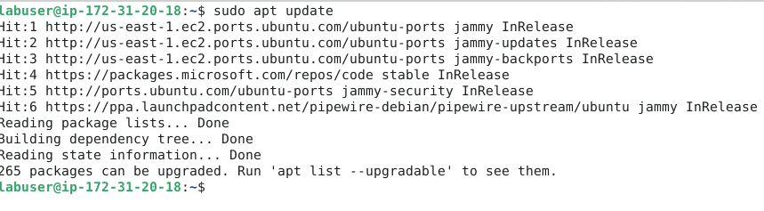
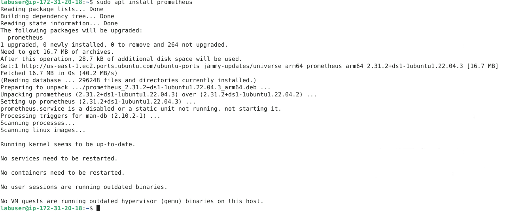
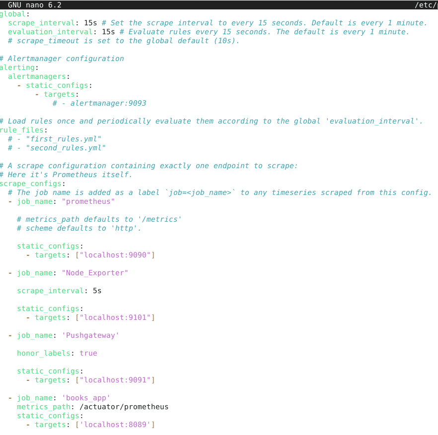
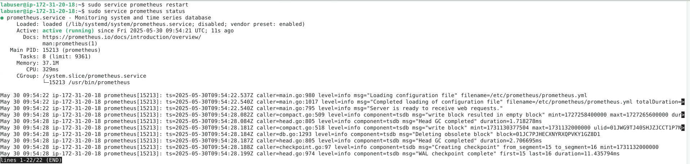
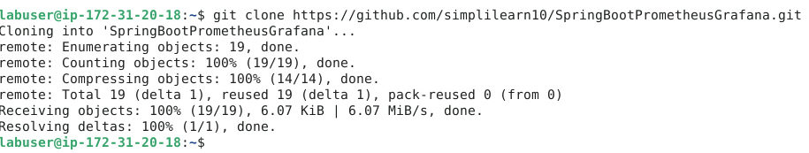
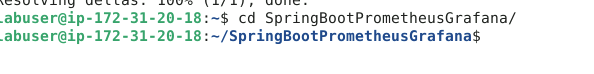

# Application Metrics Monitoring
This repository holds the final project for a course on Application Metrics and Monitoring in a DevOps context. It demonstrates the practical implementation of key concepts, including application instrumentation, metrics collection (e.g., using Prometheus), data visualization (e.g., using Grafana), and setting up a basic monitoring pipeline to gain insights into application performance and health.

## Step 1: Log in to the Linux terminal and install the Prometheus metric server

- **Run the following commands to install Prometheus on the system**
```bash
$ sudo apt update
$ sudo apt install prometheus
```



- **Run the following command to open the Prometheus configuration file for editing**
```bash
$ sudo nano /etc/prometheus/prometheus.yml
```


- **Scroll to the bottom of the file, locate the scrape_configs section, and add the following content, and save the file**
```YAML
- job_name: 'books_app'
  metrics_path: /actuator/prometheus
  static_configs:
    - targets: ['localhost:8089']
```


- **Restart prometheus and check its status**
```bash
$ sudo service prometheus restart
$ sudo service prometheus status
```


## Step 2: Configure Java Application to publish custom metrics for API responses to the Prometheus collector

- **Run the following command to clone the git repository**
```bash
$ git clone https://github.com/simplilearn10/SpringBootPrometheusGrafana.git
```


- **Navigate to the project folder using the following command**
```bash
$ cd SpringBootPrometheusGrafana/
```
