# Application Metrics Monitoring
This repository holds the final project for a course on Application Metrics and Monitoring in a DevOps context. It demonstrates the practical implementation of key concepts, including application instrumentation, metrics collection (e.g., using Prometheus), data visualization (e.g., using Grafana), and setting up a basic monitoring pipeline to gain insights into application performance and health.

## Prerequisites
- A Linux-based operating system (e.g., Ubuntu)
- Java Development Kit (JDK) 8 or higher
- Maven
- Git
- curl
- wget

## Step 1: Log in to the Linux terminal and install the Prometheus metric server

- **Run the following commands to install Prometheus on the system**
```bash
$ sudo apt update
$ sudo apt install prometheus
```


- **Run the following command to open the Prometheus configuration file for editing**
```bash
$ sudo nano /etc/prometheus/prometheus.yml
```


- **Scroll to the bottom of the file, locate the scrape_configs section, and add the following content, and save the file**
```YAML
- job_name: 'books_app'
  metrics_path: /actuator/prometheus
  static_configs:
    - targets: ['localhost:8089']
```


- **Restart prometheus and check its status**
```bash
$ sudo service prometheus restart
$ sudo service prometheus status
```


## Step 2: Configure Java Application to publish custom metrics for API responses to the Prometheus collector

- **Run the following command to clone the git repository**
```bash
$ git clone https://github.com/simplilearn10/SpringBootPrometheusGrafana.git
```


- **Navigate to the project folder using the following command**
```bash
$ cd SpringBootPrometheusGrafana/
```


- **Run the following command to clean and build the Maven project**
```bash
$ mvn clean install
```
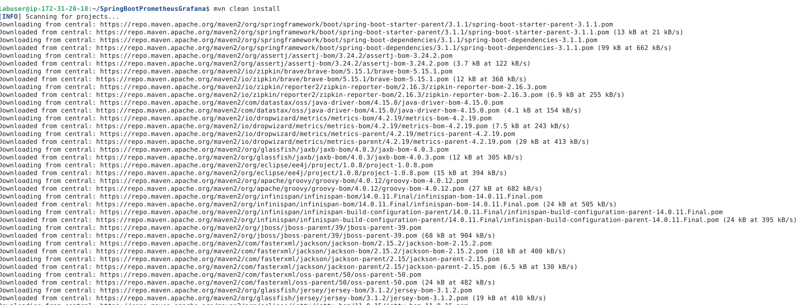
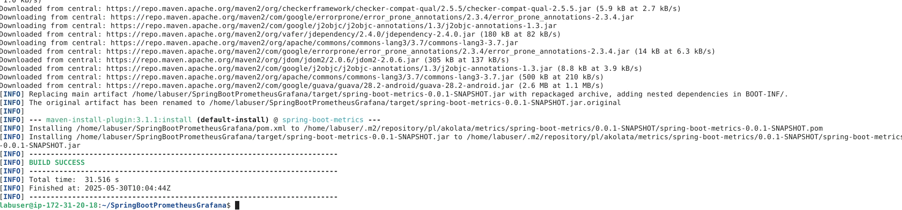

- **Run the Spring Boot application using the following command**
```bash
$ java -jar target/spring-boot-metrics-0.0.1-SNAPSHOT.jar
```


- **Fetch data from the API using the following commands**
```bash
$ curl -XGET http://localhost:8089/api/books
$ curl -XGET http://localhost:8089/api/books?title=Domain+Driven+Design
$ curl -XGET http://localhost:8089/api/books?title=Clean+code
$ curl -XGET http://localhost:8089/api/books?title=Fundamental+Algorithms
```
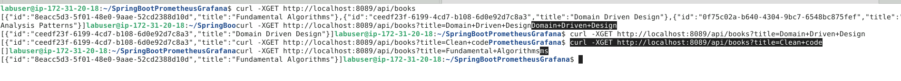

## Step 3: Configure Grafana visualization tool to visualize metrics
- **Create a directory for storing APT keyrings**
```bash
$ sudo mkdir -p /etc/apt/keyrings/
```
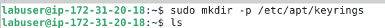

- **Run the following command to download the Grafana GPG key, dearmor it, and store it in the keyring directory**
```bash
$ wget -q -O - https://apt.grafana.com/gpg.key | gpg --dearmor | sudo tee /etc/apt/keyrings/grafana.gpg > /dev/null
```
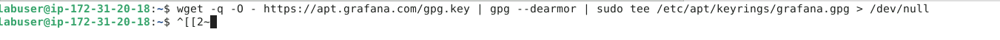

- **Add a repository for stable releases**
```bash
$ echo "deb [signed-by=/etc/apt/keyrings/grafana.gpg] https://apt.grafana.com stable main" | sudo tee -a /etc/apt/sources.list.d/grafana.list
```
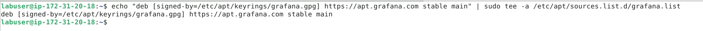

- **Run the following command to update the list of available packages**
```bash
$ sudo apt update
```
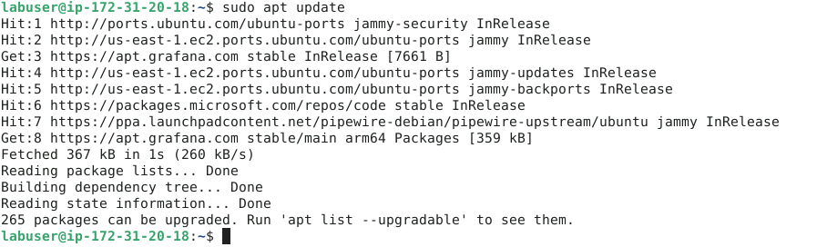

- **Run the following command to install Grafana OSS**
```bash
$ sudo apt install grafana
```
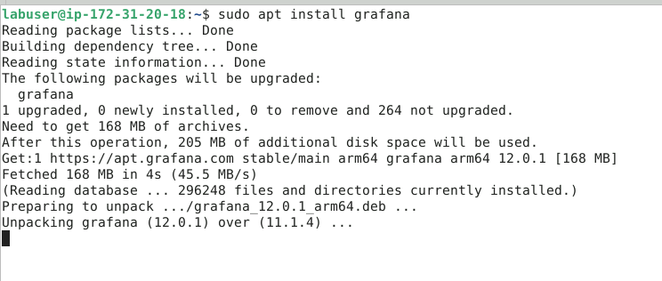

- **Start the Grafana service and check the status**
```bash
$ sudo systemctl start grafana-server 
$ sudo systemctl status grafana-server 
```

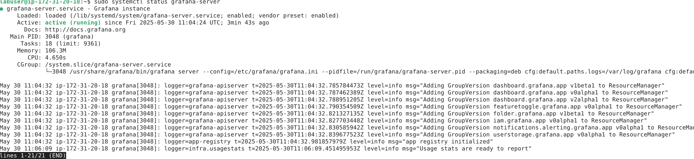

- **Access the Grafana web interface using your server’s IP address
http://your-server-ip:3000 [here it is http://localhost:3000]**
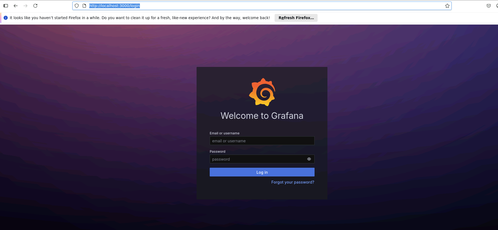

- **Log in to Grafana using the default credentials, then click Submit as shown below**
```
Username: admin
Password: admin
```

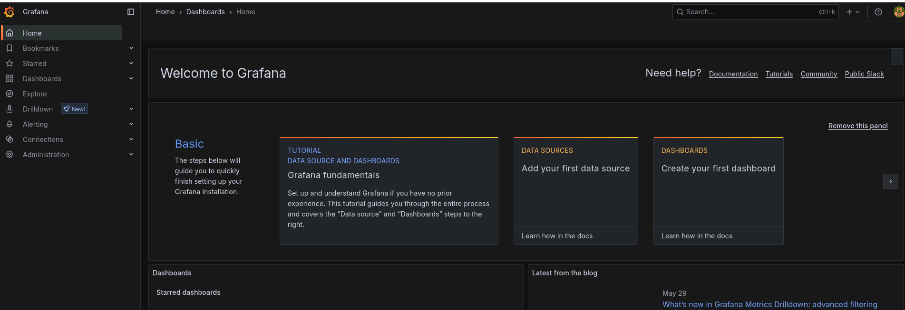

- **Go to Data sources and select Prometheus as data source, as shown   
in the screenshot below:**
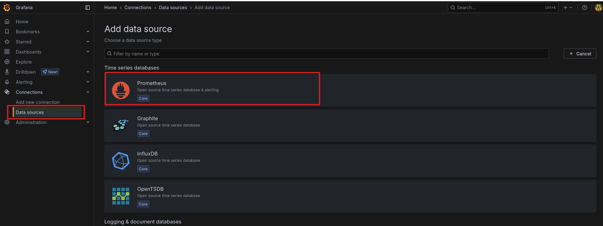
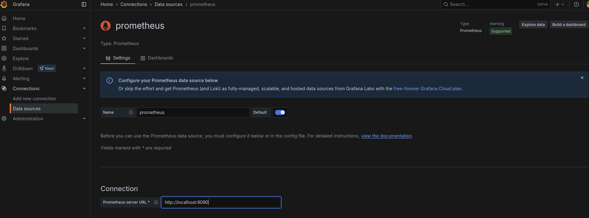
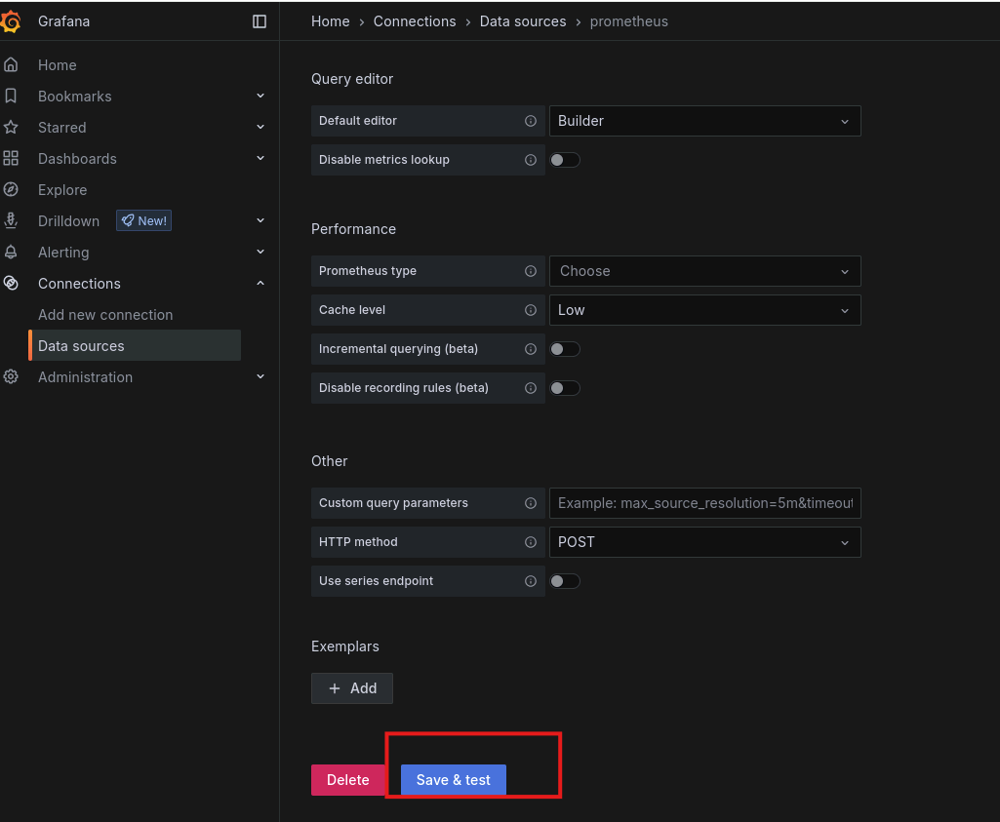

## Step 4: Create a metrics dashboard for API responses
- **Open the Grafana main menu, select Dashboard, and click 'Create dashboard'**
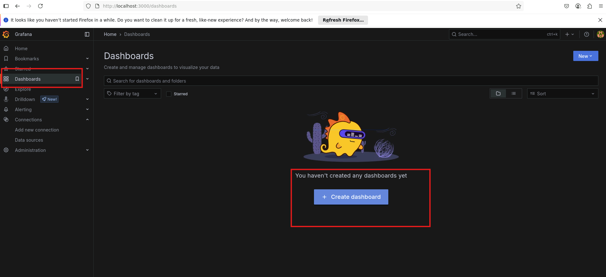
- **Click 'Add visualization'**
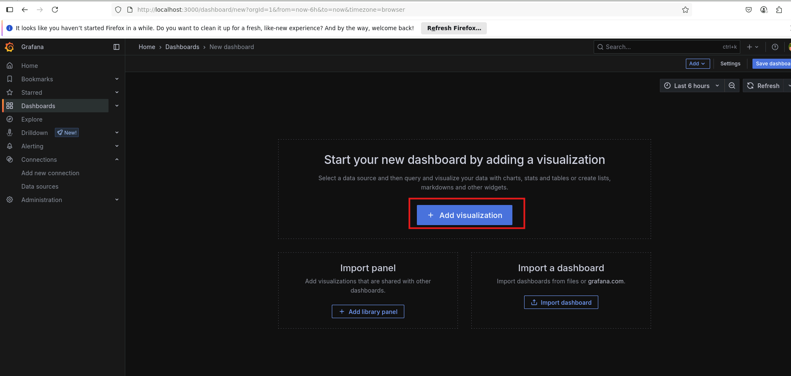

- **Select the Prometheus data source to proceed**
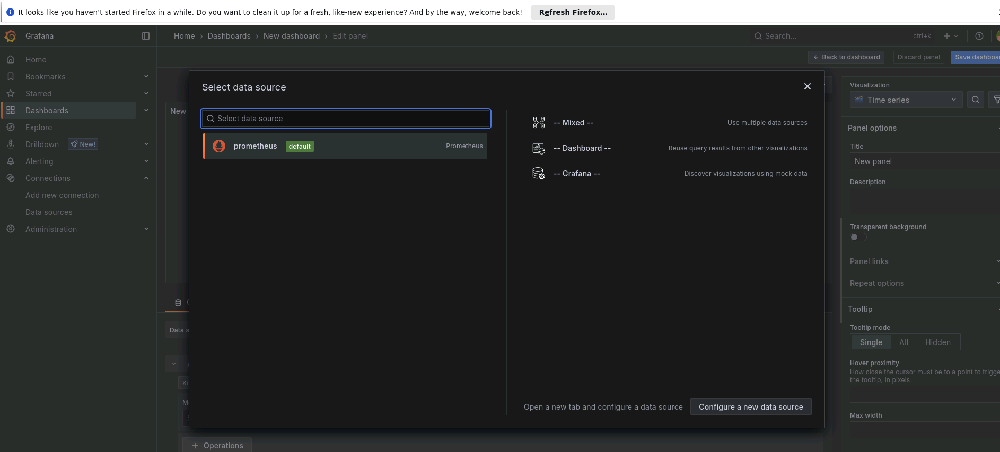

- **Add a Gauge panel using the metric books_service_books_in_store_count to represent the number of books available in stock**
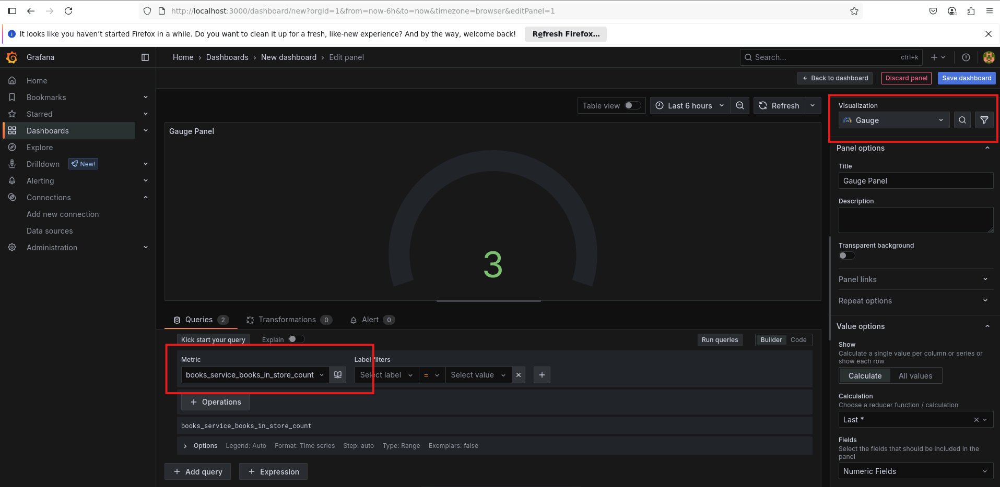

- **Use the metric books_service_api_books_get_count_total to track total API requests. Set the Legend field to {{title}} for clarity**
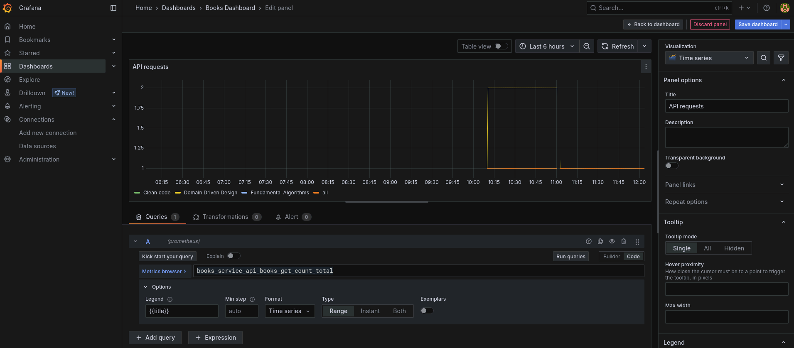

- **Enter the following query to measure the average response time for book searches and set the Legend field to {{title}}. Then, click Save**

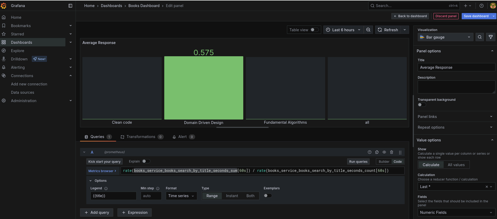

- **Below is the Grafana dashboard that visualizes API response data, including total API requests and average response time for book searches and This setup provides valuable insights into application performance and API usage.**

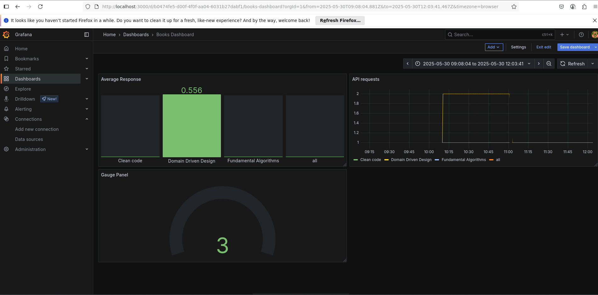


